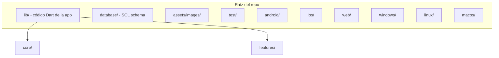
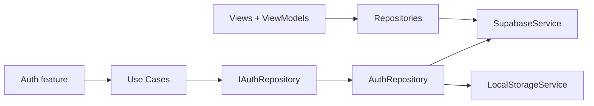
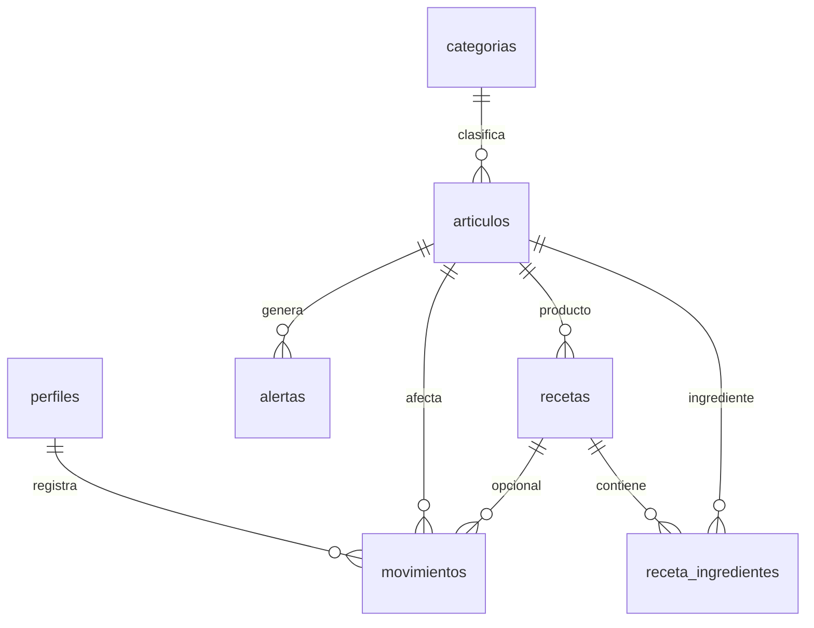
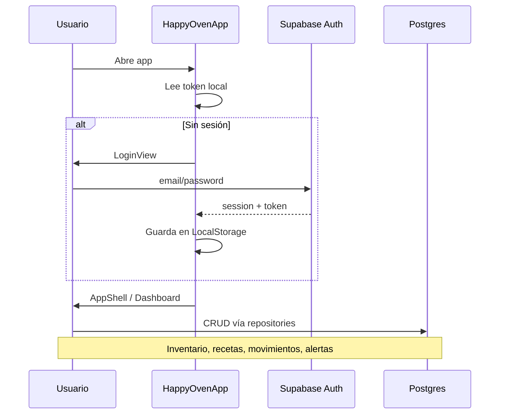

# Guía completa del proyecto Happy Oven

## Qué es el proyecto

**Happy Oven** (`happy_oven` en `pubspec.yaml`) es un sistema de **gestión de inventario orientado a panadería**: control de insumos y productos finales, recetas con costeo de lote, entradas/salidas de almacén (incluyendo OCR de boletas), dashboard analítico, centro de alertas y exportación de reportes en PDF.

- Resumen e inicio rápido: [`README.md`](../README.md)
- Dominio de datos: [`database/schema.sql`](../database/schema.sql)
- Código de la app: carpeta `lib/`

---

## Stack tecnológico

| Capa | Tecnología |
|------|------------|
| UI | Flutter 3.x (SDK `^3.10.0`) |
| Estado | [flutter_riverpod](https://pub.dev/packages/flutter_riverpod) (`StateNotifier`, `Provider`) |
| Navegación | [go_router](https://pub.dev/packages/go_router) con `StatefulShellRoute` (tabs persistentes) |
| Backend | [Supabase](https://supabase.com) (Auth + Postgres vía `supabase_flutter`) |
| Persistencia local | `shared_preferences` (token, user id, tema) |
| Gráficas | `fl_chart` |
| OCR | `google_mlkit_text_recognition` + `image_picker` |
| PDF | `pdf` + `printing` |
| i18n fechas | `intl` + `flutter_localizations` (locale `es_ES`) |

---

## Estructura de carpetas (raíz)



- **`lib/`**: Toda la lógica de negocio y UI de la app (46 archivos `.dart`).
- **`database/schema.sql`**: Definición de tablas Postgres para Supabase (7 entidades principales).
- **`assets/images/`**: Imágenes referenciadas en `pubspec.yaml`.
- **`android/`, `ios/`, `web/`, `windows/`, `linux/`, `macos/`**: Proyectos nativos generados por Flutter (compilación por plataforma). El paquete Android aún puede usar el namespace `com.example.mi_aplicacion` en algunos archivos (herencia del template).
- **`test/widget_test.dart`**: Test de humo por defecto de Flutter.

---

## Arquitectura de la app

Patrón **feature-first** con una capa **`core/`** compartida:



- **Auth** sigue algo cercano a **Clean Architecture**: `domain/` (entidades, interfaces, use cases) → `data/` (implementación) → `presentation/` (views + viewmodel).
- **Resto de features**: en general **View → ViewModel (Riverpod) → Repository → Supabase**, sin capa de dominio separada.
- **Modelos** (`Articulo`, `Receta`, `Movimiento`, etc.) viven en `lib/core/models/` y se usan en todas las features.

---

## Punto de entrada y arranque

`lib/main.dart`:

1. Inicializa `LocalStorageService` (SharedPreferences).
2. Inicializa `SupabaseService` con URL y `anonKey` **embebidos en código** (convendría moverlos a variables de entorno o `--dart-define` en producción).
3. Inicializa formato de fechas en español (`initializeDateFormatting('es')`).
4. Arranca `ProviderScope` → `HappyOvenApp` con `MaterialApp.router`, tema claro/oscuro vía `themeProvider`, y rutas de `appRouterProvider`.

---

## Capa `lib/core/`

### Router y shell de navegación

| Archivo | Rol |
|---------|-----|
| `lib/core/router/app_router.dart` | Rutas y guard de autenticación |
| `lib/core/widgets/app_shell.dart` | Scaffold con `StatefulNavigationShell` |
| `lib/core/widgets/bottom_nav_bar.dart` | 5 tabs de navegación inferior |

**Ramas del shell** (cada tab mantiene su propio stack de rutas):

| Tab | Ruta base | Pantallas hijas |
|-----|-----------|-----------------|
| 0 | `/dashboard` | — |
| 1 | `/catalogo` | `/catalogo/nuevo` |
| 2 | `/recetas` | `/recetas/nueva`, `/recetas/editar` |
| 3 | `/movimientos` | `/movimientos/ingreso-ocr`, `/movimientos/salida` |
| 4 | `/alertas` | `/reportes`, `/perfil` |

Rutas **fuera del shell**: `/login`, `/recuperar-password`.

### Servicios

| Archivo | Descripción |
|---------|-------------|
| `lib/core/services/supabase_service.dart` | Singleton: Auth y acceso a Supabase. Los métodos de perfil consultan la tabla `users`; el schema SQL define `perfiles` (ver deuda técnica). |
| `lib/core/services/local_storage_service.dart` | Token, refresh token, user id, tema |
| `lib/core/services/ocr_service.dart` | ML Kit: texto de boleta → `OcrItem` |

### Repositorios

| Archivo | Tabla(s) | Responsabilidad |
|---------|----------|-----------------|
| `articulos_repository.dart` | `articulos` | CRUD, filtros insumo/producto_final |
| `categorias_repository.dart` | `categorias` | Categorías por tipo |
| `recetas_repository.dart` | `recetas`, `receta_ingredientes` | Recetas e ingredientes |
| `movimientos_repository.dart` | `movimientos` | Kardex, entradas/salidas |
| `alertas_repository.dart` | `alertas` | Listado y marcar leídas |

### Modelos

Entidades Dart con `fromJson` / `toJson` alineadas al schema: `Articulo`, `Categoria`, `Receta`, `RecetaIngrediente`, `Movimiento`, `Alerta`, `Perfil`.

### Tema

- `lib/core/theme/theme.dart`: Paleta panadería (naranja `#FF8C42`, beige, verdes/rojos de estado), tipografía, espaciado, radios.
- `lib/core/theme/theme_notifier.dart`: `ThemeMode` (light/dark/system) persistido.

---

## Features (`lib/features/`)

### 1. Auth — `features/auth/`

**Propósito**: Login, registro, recuperación de contraseña, sesión persistente.

| Capa | Contenido |
|------|-----------|
| `domain/entities/` | `User`, `LoginRequest`, `AuthResponse`, etc. |
| `domain/repositories/` | `IAuthRepository` |
| `domain/usecases/` | `LoginUseCase`, `RegisterUseCase`, `LogoutUseCase`, `RecuperarPasswordUseCase`, `ObtenerUsuarioActualUseCase` |
| `data/repositories/` | `AuthRepository` (Supabase + local storage) |
| `presentation/` | `login_view.dart`, `recuperar_password_view.dart`, `auth_viewmodel.dart` |

El `AuthViewModel` expone `authViewModelProvider`; el router lo observa para redirects.

### 2. Visualización inventario — `features/visualizacion_inventario/`

**Propósito**: Catálogo de insumos y productos finales, estados de stock, alta de artículos.

- **`catalogo_general_view.dart`**: Lista con tabs/filtros, tarjetas de producto con receta asociada, navegación a formulario y costeo.
- **`formulario_articulo_view.dart`**: Crear/editar artículo (nombre, categoría, tipo, stock mínimo, precio, unidad).
- **`catalogo_viewmodel.dart`**: Carga artículos vía `ArticulosRepository`.

### 3. Recetas y costeo — `features/recetas_costeo/`

**Propósito**: Recetario de productos finales y editor de receta con cálculo de costo de lote.

- **`recetario_view.dart`**: Lista de productos con/sin receta.
- **`costeo_dinamico_view.dart`**: Pantalla grande (~1000+ líneas): ingredientes, rendimiento, tiempo, costo calculado; rutas `/recetas/nueva` y `/recetas/editar` pasan `Articulo` o `Receta` por `extra`.
- **`recetas_viewmodel.dart`**: Estado async de lista de recetas.

### 4. Registro de movimientos — `features/registro_movimientos/`

**Propósito**: Kardex y operaciones de almacén.

- **`historial_kardex_view.dart`**: Historial filtrable de movimientos (entrada, salida producción, merma, ajuste).
- **`ingreso_ocr_view.dart`**: Captura foto de boleta, OCR, revisión de ítems, registro de entrada con flag `por_ocr`.
- **`salida_almacen_view.dart`**: Salidas por venta, merma, degustación, ajuste; puede vincular receta/producción.
- **`movimientos_viewmodel.dart`**: Lista async de `Movimiento`.

### 5. Analítica y alertas — `features/analitica_alertas/`

**Propósito**: Dashboard ejecutivo, notificaciones y reportes.

- **`dashboard_inteligente_view.dart`**: KPIs, gráficas `fl_chart`, proyección de insumos; header con acceso a perfil.
- **`centro_alertas_view.dart`**: Alertas por tipo (`stock_bajo`, `anomalia`, `ia`, `ingreso`), marcar leídas.
- **`reportes_view.dart`**: Generación/export PDF de consumos.
- **ViewModels**: `dashboard_viewmodel.dart`, `alertas_viewmodel.dart`.

### 6. Configuración — `features/configuracion/`

**Propósito**: Perfil de usuario y ajustes de app.

- **`perfil_ajustes_view.dart`**: Datos de usuario, tema, cerrar sesión (ruta `/perfil` en rama de Alertas).

---

## Base de datos (Supabase / Postgres)

Definida en `database/schema.sql`:



| Tabla | Descripción |
|-------|-------------|
| `perfiles` | Extiende `auth.users` (rol `admin` \| `operador`) |
| `categorias` | `insumo` \| `producto_final` |
| `articulos` | Stock, precio, mínimos, unidad |
| `recetas` + `receta_ingredientes` | BOM y costo de lote |
| `movimientos` | Kardex (entrada, salida, merma, ajuste) |
| `alertas` | Notificaciones de negocio |

El schema no incluye políticas RLS ni triggers; configurarlas en el proyecto Supabase.

---

## Flujo de usuario típico



---

## Dependencias entre módulos (resumen)

- Casi todas las features dependen de **`core/models`**, **`core/repositories`** y **`SupabaseService`**.
- Solo **auth** usa **use cases** e **interfaces** de dominio.
- **Router** concentra imports de todas las views (acoplamiento centralizado, típico en apps pequeñas/medianas).

---

## Estado actual del repositorio

Navegación principal con shell persistente:

- Nuevo **`app_shell.dart`** y refactor del router a **`StatefulShellRoute.indexedStack`**.
- Vistas de features ajustadas para vivir dentro del shell (sin duplicar `BottomNavBar` en cada pantalla).
- Modificaciones en **`app_router.dart`** y **`bottom_nav_bar.dart`**.

---

## Observaciones y deuda técnica relevante

1. **Credenciales Supabase en `main.dart`**: Riesgo de seguridad si el repo es público; usar `.env` / `flutter_dotenv` o secrets de CI.
2. **Tabla `users` vs `perfiles`**: `SupabaseService.getUserProfile` usa `users`; el schema define `perfiles`.
3. **README y nombre Android**: El README del repo ya describe Happy Oven; el namespace Android puede seguir siendo `com.example.mi_aplicacion` en proyectos nativos.
4. **Dashboard**: Textos como fecha y nombre "Administrador" pueden estar hardcodeados (revisar integración con `perfiles` y usuario real).
5. **Tests**: Solo el test por defecto; no hay cobertura de features ni repositories.

---

## Cómo ejecutar (referencia)

```bash
cd d:\Happy_Oven\HappyOven
flutter pub get
flutter run
```

Requiere un proyecto Supabase con las tablas del schema y usuarios configurados en Auth.
